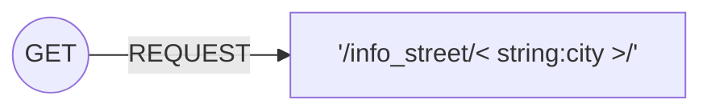
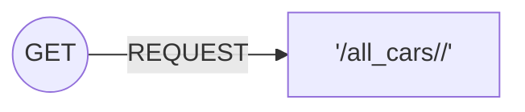
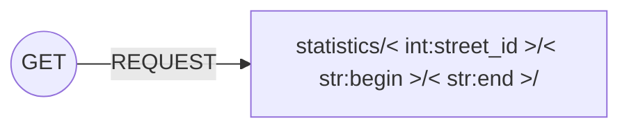
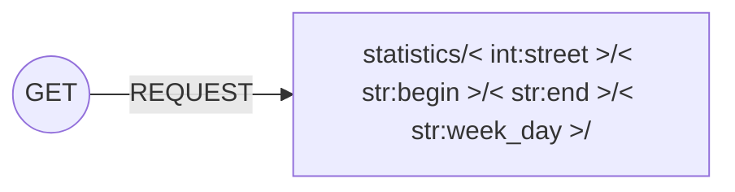
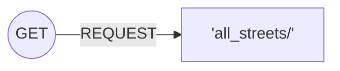
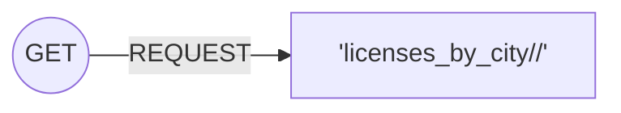
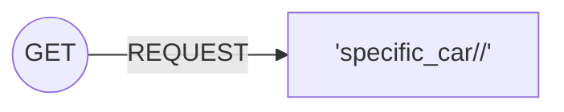
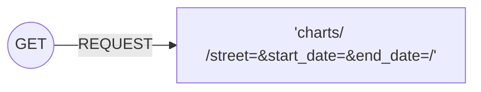
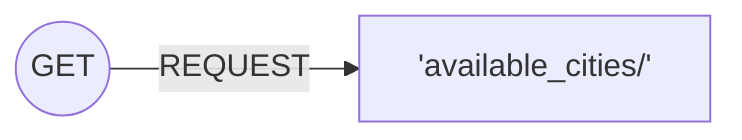

# REST API Documentation

# GETS
## Get all streets of a certain city

### Possible HTTP Responses
> **HTTP_200_OK** -> Returns an array of dictionaries containing information about the current state of each section for that specific city 

> **HTTP_400_BAD_REQUEST**

**Example**
**GET ``` /info_street/Aveiro/```**
```python
[{
        "id": 1,
        "number_cars": 0,
        "actual_direction": true,
        "n_accident": 0,
        "beginning_coords_x": 0,
        "beginning_coords_y": 0,
        "ending_coords_x": 0,
        "ending_coords_y": 500,
        "street": {
            "name": "Rua Tenente Joaquim Lopes Craveiro",
            "id": 1
        },
        "transit_type": "Normal",
        "police": false,
        "visibility": 100
    }

    ... 
    ...
}] 
```

## Get all cars of a certain section of a street

### Possible HTTP Responses**
 > **HTTP_200_OK** -> Returns an array of dictionaries containing the license plate and the section

 > **HTTP_400_BAD_REQUEST**
 
 > **HTTP_404_NOT_FOUND**


**Example**
**GET  ``` /all_cars/1```**
```python
[
    {
        "license_plate": "mota10",
        "section": 1
    },
    {
        "license_plate": "mota11",
        "section": 1
    }
]
```

## Get statistics of a certain street with a beginning and end time

### Possible HTTP Responses
 > **HTTP_200_OK** -> Returns a dictionare with the name of the street, number of times that it got transit (in minutes), with roadblocks and total accidents during that time frame

 > **HTTP_400_BAD_REQUEST**

 > **HTTP_404_NOT_FOUND**

**Example**
**GET  ``` /statistics/1/2017-12-31/2019-12-31/```**
```python
{
    "name": "Rua Tenente Joaquim Lopes Craveiro",
    "transit_count": 15,
    "road_block": {
        "total_time": 500,
        "times": 1
    },
    "total_accident": 4
}
```

## Get statistics of a certain street with a beginning and end time that happen on a specific week day (Monday,Friday,...)

**Possible HTTP Responses**

 > **HTTP_200_OK**-> Returns a dictionary with the name of the street, number of times that it got transit (in minutes), with roadblocks and total accidents during that time frame but that only in that specific week day 

 > **HTTP_400_BAD_REQUEST**

 > **HTTP_404_NOT_FOUND**


**Example**
**GET  ``` /statistics/1/2017-12-31/2019-12-31/Monday/```**
```python
{
    "name": "Rua Tenente Joaquim Lopes Craveiro",
    "transit_count": 10,
    "road_block": {
        "total_time": 500,
        "times": 1
    },
    "total_accident": 3
}
```

## Get all the streets that are in the database


**Possible HTTP Responses**

 > **HTTP_200_OK** -> Returns a list of dictionaries containing the id and name of the streets in the database , being that key represents the id and value represents the name

 > **HTTP_400_BAD_REQUEST**

 > **HTTP_404_NOT_FOUND**


**Example**
**GET  ``` /all_streets/```**
```python
[
    {
        "key": 1,
        "value": "Rua Tenente Joaquim Lopes Craveiro"
    },
    {
        "key": 2,
        "value": "Rua de Caveiros"
    }

    ...
    ...
]
```
## Get all the licenses plates (Cars) in every section of a specific city



**Possible HTTP Responses**

 > **HTTP_200_OK** -> Returns an array with a dictionary having the key as the section id and licenses being a list with all the license_plates in that section. All the sections belong to the city passed in the URL

 > **HTTP_400_BAD_REQUEST**

 > **HTTP_404_NOT_FOUND**


**Example**
**GET  ``` /licenses_by_city/Aveiro/```**
```python
[
    {
        "id": 1,
        "licenses": [
            "mota10",
            "mota11"
        ]
    },
    {
        "id": 2,
        "licenses": [
            "mota12"
        ]
    }
    
    ...
    ...
]

```
## Track a specific car


___
# WARNING License Plate is case sensitive
___
**Possible HTTP Responses**

 > **HTTP_200_OK**-> Returns a dictionary with the wanted license plate and the section it is in

 > **HTTP_400_BAD_REQUEST**

 > **HTTP_404_NOT_FOUND**


**Example**
**GET  ``` /specific_car/mota10/```**
```python
{
    "license_plate": "mota10",
    "section": 1
}
```
## Get the number of a specific type of incident (accidents...) in a street for each day in a time frame 


___
# WARNING Dates should be passed with Year-Month-Day, otherwise a BAD_REQUEST will be thrown
___
**Possible HTTP Responses**

 > **HTTP_200_OK** -> Returns a dictionary contains two lists, one with the days and another with the ammount of incident that occured in that day. The index of list 1 corresponds to the same index of list two. In the following example this means that in 2019-12-16 the street with id 1 had 3 incidents of type accident

 > **HTTP_400_BAD_REQUEST**

 > **HTTP_404_NOT_FOUND**


**Example**
**GET   ``` /charts/accident/street=1&start_date=2019-12-12&end_date=2019-12-22/```**
```python
{
   {
    "Days": [
        "2019-12-12",
        "2019-12-13",
        "2019-12-14",
        "2019-12-15",
        "2019-12-16",
        "2019-12-17",
        "2019-12-18",
        "2019-12-19",
        "2019-12-20",
        "2019-12-21"
    ],
    "ammount": [
        0,
        0,
        0,
        0,
        3,
        0,
        0,
        0,
        0,
        0
    ]
}
}
```

## Get all available cities in the database


___
# WARNING Cities is case sensitive
___
**Possible HTTP Responses**

 > **HTTP_200_OK** -> Returns a list with all the cities currently mapped in the database

 > **HTTP_400_BAD_REQUEST**

 > **HTTP_404_NOT_FOUND**


**Example**
**GET   ``` /available_cities/```**
```python
[
    "Aveiro",
    "Porto"
]
```
