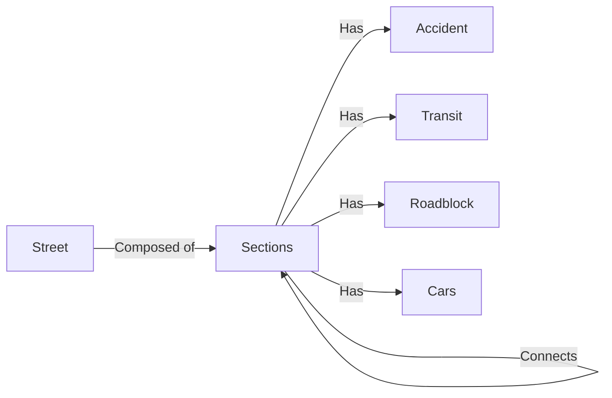

# Final Report

## Product Abstract
Traffic Jammer is a web application that allows you to view traffic close to you (as a regular user) and manage your city through a very detailed dashboard (administrator). Users with special access (admins) can also create new streets on each city. Features include:
* Simple interface for visualizing the traffic around you, don't waste time in traffic anymore.
* Relevant statistics concerning your city's roads including: roadbloack, traffic jams , police location and car crashes.
* Track specific cars in a given city.
* Beautiful and easily usable interface both for clients and administration.

## Relevant Links
* [API Documentation](https://gitlab.com/myiesgroup/iesproject_trafficjammer/blob/master/Reports/RestApi.md)
* [Website](http://192.168.160.237:8800)
* [API Endpoint](http://192.168.160.237:8000)
* [Prototype](https://gitlab.com/myiesgroup/iesproject_trafficjammer/tree/master/Prototype)
* [Project Guidelines](https://gitlab.com/myiesgroup/iesproject_trafficjammer/blob/master/Reports/ProjectGuidelines.pdf)
* [Work Tracker](https://gitlab.com/myiesgroup/iesproject_trafficjammer/-/boards)

## Users stories that lead to the development of this project
* John is a university student residing in Ilhavo currently studying in Aveiro. Before leaving home he wants to know what road to take and to that he needs to know what roads are blocked today, if there are  any accidents in his usual route, how is the transit in the roads leading to his university. He needs all this information so that he may be aware of  the time he will take to reach class and what path to take to be more effecient.

* Barbara is a office worker for Esgueira Town Hall. She was assigned the job of understanding what are the critical streets in her city in order to try and approve changes that will fix these situations. She wants to have statistical data from years back to the current days , and to be able to handle this data in different ways, for example to check if the accidents happen every day or if they happen more on Mondays and Fridays or if a street was having a lot of road blocks something is not working properly and should have been fixed in a single roadblock and not over many roadblocks.

## Requirements
The basic requirements for the implementation of this project were:
 * Distributed generation of data stream
 * Data publishing using message oriented protocol
 * Long term storage
 * Central processing
 * Service API
 * Web Portal

## Architecture

## Server
### Why Django?
    1. Django in a overall aspect is simpler and has the least ceremony which leads to a more productive environment.
    2. Django, unlike, Spring has less mental overhead, there are no Beans,XML configurations, dependencies to be injected... This makes Django easier to understand and to start developing ,this helps the programmer enjoy the project working on.
    3. Django Admin is a really good aspect and feature that makes it easier to understand the environment and see what is going on.
    4. Django is in 979 company stacks while Spring is only in 316 stacks this makes it that programmers are more inclined to choose Django, and with more people working on it comes more ways to find out your problems and more well-rounded solutions to common problems. Django also has one of the best all around documentation.
    5- Starting a prototype and evolving from a small concept to a big fully functionaly product is simple and can be done even without any pre-defined structure.
    6- Django guides us throughout the project, by default it creates the basic needs for everything to work and we just scale it from there.
    7- Django isn't as capable in terms of big enterprise projects as Spring, but due to our small reach requirements Django was already a tool with more capabilities than we needed so it was a no brainer to use a tool that was harder to work with for this job.
    
### Why RabbitMQ?
    1.RabbitMQ is a simple and effective message queueing broker.
    2.RabbitMQ supports a wide range of communication protocols.
    3.RabbitMQ has a Python Client (Pyka) which goes with what we wanted to do, which was simple and effective developing. 
    4.RabbitMQ can handle 2305843009213693951 bytes (from the documentantion), which was more than enought for the the amount of data we were generating  (around 1000,if not more, producer inputs every second).
​
### Why SQL and why not!
    1. We all have a background working with SQL and the relational model and it's tools seemed to be the right option for the job.
    2.In the aftermath, SQL became a bottleneck, the amount of data we were inserting was so massive SQL wasn't able to handle it properly, to avoid swapping to a better database model (because of the implications this would bring to the development process) we created some workarounds (aggregation of requests and lowering the thresholds).
    1. We have a lot of incoming data, but almost none of it happens to change the same values in the database, everything we save is more in line with a log based structured.

### Processing and Bizz logic
    The server processes the flowing sensor data and works with it accordingly.
    The main logic is that we receive incoming traffic, police notifications, roadblock updates, visibility changes and accidents and save it in order to give the exact response based on what a client wants to see.
    If a client wants to see all the data of a city (in the current moment), it requests it, the server having the knowledge of everything that is going on in each road/section takes the data and gives an ouput based on that, being it that the state of a street is never calculated client side, the server has the logic and works accordinly. So, having this in mind, the server can send various states of traffic (Normal,Medium,Congested,Blocked), being it that it depends on how much traffic there is, if there is any roadblock in the section and how much visibility the section has (if it is foggy we threshold for traffic becomes lower, meaning that a road will become congested easier).
    If the client wants to see statistics about a certain road the server doesn't have it stored as it is,he receives the request does some work (aggregations,time conditions,week days...) and based on that he send the response back to the client.
    The same logic applies to the other requests, we initially receive raw data, we handle it, we save it in a certan way and when requested for it we have processes that send an answer that suits what the client is asking for.
    If the client , or even a faulty sensor,for some reason ends up sending a bad request or data that doesn't fit the system we handle it appropriately and send a request that let's them know what the internal error was.

### How the database is modeled

​
 - **Rua is a table with the attributes:** 
     - Name of street, 
     - beginning coordinates, 
     - ending coordinates, 
     - length, 
     - city ,
     - autogenerated long ID number for primary key;
 - **Trecho is a weak entity:**
     - Boolean value for increasing (True) vs decreasing(False) to distinguish directions
     - ID of street
     - Beginning coordinates
     - Ending coordinates
     - Number of cars
     - Number of accidents
     - Current Visibility (0-100)
     - Roadblock (True or False)
     - Police (True or False)
     - Prime key: id+bool+beginning
 - **Acidente is basically a logger entity:**
     - Date of accident
     - Coordinates for the accident (the exact place)
     - The section where it happened
 - **Congestao is another logger:**
     - Date of congestion
     - The section where congestion happened
 - **Blocked is another looger entity:**
     - Start date
     - End date (starts being null, only updated when roadblock ends)
     - Section that is / was blocked
 - **Cars is a tracker of which car and where they are:**
     - License Plate
     - Current section

## Web Application
    For the web development we chose to go with React since one of our developers already had some experience with the technology and there are plenty of modules that could help us achieve what we wanted to do.  

### TrafficWeb (View Traffic)
    One of the biggest challenges we faced while going for basic HTML with JavaScript was that the Canvas element weren't enough, since with canvas we couldn't draw dynamic lines and once we updated the colors, all the canvas would change. 
    So we came up with a crafty solution: Using a library called: Konva.js (1)
    we were able to draw multiples lines (with customizable parameters) in a personalized canvas. This allowed us to draw dynamic maps according to the information we got from the server, and repopulate the canvas every X seconds so we could see *real time* changes to the map.
    The use of async with the nature of message protocols and it's quirks (time it takes for a message to go , be processed and answered) we can have a somewhat weird interaction with the map, being it that if we change city often the webclient can receive an older request while already being in a new city therefore displaying the wrong map. 

(1) -> [Konva.js](https://konvajs.org/) 
    

Keypoints for implementation:
 * Dynamic map creation using an algorithm
 * Real time map view
 * Tracking specific cars
 * Allow the user to search multiple cities

### Dashboard (View traffic data)
    For the dashboard we can have several options that help us with viewing relevant data concerning each city's streets. This data is viewed through a typical display of number, but also through a chart made using [ChartJS](https://www.chartjs.org/)  
These parameters are customizable:
 * City
 * Street
 * Start Date
 * End Date
 * Week day

### Administration
In the administration page we are able to create a new street, if it passes all needed requirements, which are:  
 * Being in an available city
 * Having a unique name
 * Having beginning coordinates differ from the ending

    In the future, we intend for an administrator to also be capable of doing some editing in the sections of the streets, e.g. directly tell the system if a road is blocked, or if there is police activity. These ideas ,for future work, should in real world cenario be provided in real time by the sensors and that was the reason we focused more on the main goals we proposed and left out this part.

## Mobile Application
    We inteded to create a mobile application that would display the maps and would send push notifications if the traffic nearby was rapidly increasing. But, the core of the project was made using a library that wasn't available in ReactNative, and so, we had to pushback our changes in mobile and focus on the website.

## SensorData​

### City creation  
​
    In order to watch this project working we needed to introduce cities to the DataBase.  
    A set of streets belonging to a city was generated with a Python script and fed to the API. After the insertion of the data, a set of Sections was returned that will be used later on.  
​
### Sensor Virtualization  
​
    The main goal with this part of the data generation is to sucessfully replace real sensors by a script that generates data in a similar,close to real,way.  
    We could opt to create a set of static messages to recreate the same scenario every time but we decided to go for a more bold move and let the messages be created randomly by a somewhat consistent virtual sensor.  
    Initially, our intention was have a raspberry generating full time data for us, but since we could not get one in time and probably wasn't worth it (due to the low computacional capacity), we decided to run this sensors in our own PCs.  
    ​
    The previously returned sections are divisions of the generated streets.
    These sections are required for the next step (virtualization of sensor data). It was needed to run a few more python scripts on this sections to put them in the desired way, for example find all the connections between Sections so that in the simulation, cars would go from one section to another without magicaly appearing in the order side of the map. Note as well that this responsability should not be from the server, as this consistency in sensor virtualization would not be a concern in a real word project. 

#### File doEverything.py
**Usage**  ​
>python3 doEverything.py fileContainingStreets CityName  
​

    Will send the server the information required to create a city as well as processing the returning data in the desired way. The result, a file named CityName.txt wich would be fed to the sensors script (this file contains the connections of every section to facilitate consistency).  
    ​
#### File Send.py
There are two ways of running send:

* Normal distribution across all streets with routing enabled (1)
* Start the population of a street - Insertion of 20 to 70 cars per street (2)

​**USAGE**
>python3 send.py ConnectionsFile(retured by doEverything.py) (1)

>python3 send.py ConnectionsFile populate (2)

Send.py is the main script of data generation. 
It is a producer sensor that generates various types of messages and stores them in RabbitMQ queues.
The data generation follows the required parameters for each type of message specified in the API Documentation.  
In total,we have 5 different sensors,each one with different responsibilities:  
​
- Car movements -> Adds cars or removes cars from sections, being it that cars can move from one street to the other if these streets connect.
- Police Location -> Adds and removes police to and from some streets
- Road blocked -> Adds and removes roadblocks (anything that impedes traffic)
- Accident Location -> Adds and/or removes accidents from a section, adds the specific coordinates in a given section
- Visibility -> Alters the visibility of the some sections, being it that less visibility makes it harder to drive
​

    As said before, these messages are stored in 2 RabbitMQ queues (Car movements gets a queue of his own due to high loads of data generation,this is done in order to unsynchronization issues in the other messages).  
    Without getting in unecessary details, this script uses one of the API GET methods to have an idea of the internal state of the data in the DataBase, and then, from there continuosly generates messages to get the simulation running.  
    Note, that the information about cars and sections is only asked once, and from there the script keeps a representation of the data so that the server doesn't need to perform unecessary work, this is because of how these setups/sensors would behave in the real world as mentioned above.  
    All the other messages are not very costly so before creating them the server gives information about police locations, etc.
    ​

The messages are json Objects, for example:
​
- {"type": "insert", "id" : 5, "plate":AL16PO, "city": "Ilhavo"}
- {"type":"visibility", "id":6, "visibility": 50, "city":"Ilhavo"}
​

​
#### File Receive.py
​
**USAGE**
>python3 receive.py 

    Receive.py is the consumer of Rabbit-MQ and his target is to process and forward the sensor messages to the server using the API methods.  
    Since the there are a lot of car movements messages and our group had issues with performance in early tests, this data is sent in *bulk mode* to the server to minimize the communication between this end of the queue and the server (100 messages are aggregated before they are sent to the server).The messages sent in these *bulk mode* maintain the order that they were generated in.
​
>python3 receive.py  
    ​
    We can have has many sends running (1 for each city) as we want, but we only need one receive.

## DevOps with Git and Docker
### The Structure of the Repository
    In the beginning of the project, we assigned a part of the project for each person to work on. For the master branch not to be clouded with useless or non-functioning code, a branch was assigned to each job, for the frontend, backend and data generation. Some extra branches were created as the job required, for extra features or hotfixes to solve bugs in the code.
    Furthermore, as the job went, we established tasks for each person to do in the Gitlab. Initially the simple, more general ones were assigned, and then each programmer would subdivide these features into subproblems they had to solve, noting down those smaller problems.
    Finally, when it comes to finishing one of these subproblems, a merge request or pull request is issued to the DevOps master, who would then review the changes and approve the request if it came down to it. After the merges were done, the new code would be pushed. In the beginning these would be just standard, but after the CI/CD component was finished, these changes would pass a pipeline of deployment, seeing if it would run in the environment, and if any errors in compilation were raised.
### Building the Environment With Docker
    To build the environment for the project, a different Dockerfile was made for each component, setting up the environment accordingly. For instance, the frontend was done with the React.js framework: using this framework means installing a lot of different dependencies and running different build commands for it to be officially running. Docker makes this a lot easier and automated.
    Building from a local dockerfile makes it so that all dependencies, old and new, are installed properly every time we'd want to set up the environment; something that would regularly need a chain of bash commands to function, would now be done by simply building and running a docker image.
    It also adds a needed level of abstraction to the project, which is important in terms of security. Even though we didn't go too overboard on this part of the project, building the environment from a docker and running that environment, is a way of sandboxing the project. So an attack on the system that could prove terrible if it was ran directly on the server, is a non-issue running on a Docker environment.
    Now, building one Dockerfile makes one of the component's environment, but this project required more than just one Dockerfile. To automate this process of building all the Dockerfiles, we started by building a docker-compose file. This file would build all needed docker environment and assign them the respective ports. Building the environment for the project became two commands.
    However, while this idea was good in theory, and it worked if done manually, it seemed to fall apart when trying to implement it from a pipeline for CI/CD, maybe due to other errors caused from inexperience.
### Continuous Integration and Deployment with GitLab
    This component was, by far, the most troubling issue for an inexperienced DevOps Master. With no experience on the inner workings of the pipelines or how gitlab would implement the integration, a lot of time was spent just reading the official documentation and reading through different articles and tutorials.
    In a nutshell, the CI/CD is done from a document in the root of the project. In the file, we specified two important stages: cleanup, where, if possible, you must clean up the docker images that may be running; and the deploy stage, where we deploy the needed environments.
    In the side of the server, we added a gitlab runner, who is programmed to run the pipeline, deploying the website in the process. This runner is programmed to run all the jobs needed, and in order, so that there's no inconsistencies. As expected, if an error in the building occurs, the pipeline fails and the error is sent to the devops master.
    To make things more foolproof, the jobs are designed to only work from the master branch, so that the runner doesn't run inconsistent code.

## Work-Flow
    From the get go we defined that we should work using an Agile method, in this case we decided to work using SCRUM. This implied that we would swap ideas often , group up every week and update the backlog often and keep lifecycles of sprint small.
    We did,in fact, manage to follow a SCRUM based development, even when we were having work from other classes.We met every Thursday to access the progress that was made and understand what was being done with each division of the project. A part from the weekly meetings we had continuous track of what everyone was doing by using the Boards feature of gitlab.
    Furthermore we keep a private Slack channel where ideias,features,errors, discussions,... were traded in order to maximize our time.
    This methodology lead us to be on track with almost everything we wanted to do and to avoid obvious pitfalls of over documentation before having a small but working product.

## SWOT Analysis

**Strengths**
   
    > Real time monitoring - Data in the webclient is only 4 seconds separated from reality
    > Dynamic map creation - Any map can be used that the frontend and backend will adapt and properly display and work with it
    > Relevant data analysis tools to find patterns in traffic - We can check what happened, when, how many times in the last month, how many times in the last month in a certain weekday..
    > Robust API for future clients - The backend can deal with any type of requests , responding with standards if the request isn't in line with what was supposed. The backend has more endpoints that those used in these demo,all endpoints can be found in the link below:
 [REST API endpoint](https://gitlab.com/myiesgroup/iesproject_trafficjammer/blob/master/Reports/RestApi.md)

**Weaknesses**

    > Scalability for bigger maps - Due to the early database model choice the way the data is being generated can become troublesome with bigger maps.
    > Absolute Coordinates Mapping - The way the map is generated needs a input generated based on coordinates that aren't geographical, this could be fixed if we used used geographical , but since we have had no knowledge or clue of how to work with them , in both backend and frontend, we refrained from using it and stayed with a more down-to-earth approach. 

**Opportunities**

    > Provide API for different interfaces - The nature of the API and the models are prone to be reusable in other cenarios.
    > Relevant data for city halls - Having knowledge of what is happening and how often is a good start point to understand what to fix in order to have a more functional city
    > Create better conditions for less accidents - Goes hand in hand with the point above, awareness is the key to solving a lot of the problems that happen in the streets nowadays.

**Threats**

    > Code dependency on libraries - Our work works on top of other libraries and that can be a barrier for future work, like it showed to be in the case of having a working mobile app

EXTRA:
Teacher asked for the website used in Tecnologias Programacao Web.
Wait a while for the hosts to load.
[TPW](http://tpw-cars.herokuapp.com/)